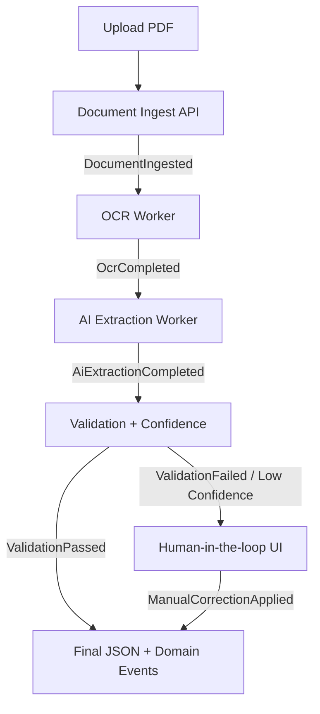

# AI-driven Document Processing Platform

System do **niezawodnego przetwarzania dokumentów** (PDF, faktury, umowy) z użyciem AI, event sourcingu i pełnej obserwowalności.

## Cel projektu

Po 5 minutach przeglądu repo ma być jasne, że projekt demonstruje:

- projektowanie systemów rozproszonych i event-driven,
- failure-proof pipeline z komponentem AI (niedeterministycznym),
- świadome decyzje dot. kosztu, latency, retry, idempotency,
- praktyczne podejście do traceability, replay i audytu.

## Problem biznesowy

> Dokumenty są niejednoznaczne, AI się myli, dane są niepełne — a system musi być deterministyczny.

Kluczowa zasada: **AI nie jest źródłem prawdy**. Źródłem prawdy jest **event log + reguły walidacji + korekty człowieka**.

---

## High-level architecture



### Proponowany stack (MVP)

- **Backend:** .NET 8 (Web API + workers)
- **Event sourcing:** EventStoreDB (lub append-only stream w DynamoDB)
- **Workflow orchestration:** AWS Step Functions + SQS + Lambda/containers
- **Storage:** S3 (oryginał + artefakty OCR), DynamoDB (read model)
- **AI providers:** abstrakcja nad OpenAI / Bedrock / Azure OpenAI
- **Frontend:** Angular (review & correction UI)
- **Observability:** OpenTelemetry (traces, metrics, logs)
- **IaC:** Terraform lub CDK (minimalny, ale kompletny przepływ)

---

## Kluczowe decyzje architektoniczne

## 1) Event sourcing „na serio”

Każdy etap życia dokumentu jest reprezentowany zdarzeniami domenowymi.

Przykładowe eventy:

1. `DocumentIngested`
2. `OcrRequested`
3. `OcrCompleted`
4. `AiExtractionRequested`
5. `AiExtractionCompleted`
6. `ValidationCompleted`
7. `ManualReviewRequested`
8. `ManualCorrectionApplied`
9. `DocumentFinalized`

### Dlaczego to działa

- pełny audyt decyzji,
- replay dla poprawy modeli/heurystyk,
- łatwy rollback read modelu,
- naturalna idempotencja po `eventId` i `documentId + step + attempt`.

## 2) AI jako komponent niedeterministyczny

Pipeline zawiera jawne mechanizmy ograniczające ryzyko:

- **confidence score per field** (np. `invoice_number`, `net_amount`, `due_date`),
- **multi-run extraction** (N prób / N modeli),
- **fallback provider/model strategy**,
- **diff outputs** (porównanie struktur JSON),
- **manual override** zapisany jako event.

Przykładowa polityka:

- `confidence >= 0.90` + reguły walidacji OK -> auto-finalize,
- `0.70 - 0.89` -> kolejna próba innym modelem,
- `< 0.70` lub konflikt reguł -> review przez człowieka.

## 3) Observability jako element produktu

Każdy dokument dostaje `correlationId` propagowany przez cały flow.

### Minimalny zestaw telemetryczny

- **Trace:** ingest -> OCR -> AI -> validation -> review/finalize,
- **Metrics:**
  - `doc_processing_latency_ms` (per etap),
  - `ai_cost_usd_total` i `ai_cost_usd_per_doc`,
  - `ai_failure_rate`,
  - `manual_review_rate`,
- **Structured logs:** `documentId`, `eventId`, `attempt`, `provider`, `model`, `correlationId`.

## 4) Human-in-the-loop UI (minimalne, funkcjonalne)

Zakres Angular MVP:

- podgląd PDF,
- podświetlenie pól + confidence,
- edycja błędnych wartości,
- przycisk zatwierdzenia wysyłający `ManualCorrectionApplied`.

Cel UI: domknięcie procesu decyzyjnego, nie design system.

---

## Niezawodność: retry, idempotency, determinism

### Retry policy

- exponential backoff + jitter,
- max attempts per step,
- dead-letter queue dla trwałych błędów.

### Idempotency

- każdy consumer zapisuje `processedEventIds`,
- finalizacja dokumentu tylko raz (`DocumentFinalized` jako event singleton),
- deduplikacja po `documentId + step + attempt`.

### Determinizm biznesowy

- wynik końcowy to efekt reguł + eventów,
- AI może proponować, ale nie zatwierdza samo bez walidacji polityk.

---

## Plan implementacji (8-tygodniowy after-hours)

1. **Tydzień 1-2:** event model + ingest + storage + read model.
2. **Tydzień 3:** OCR stage + trace propagation.
3. **Tydzień 4-5:** AI extraction adapter + confidence + fallback.
4. **Tydzień 6:** validation engine + deterministic rules.
5. **Tydzień 7:** Angular review UI + manual correction event.
6. **Tydzień 8:** hardening (SLO, dashboards, replay demo, chaos tests).

---

## Co pokazać na rozmowie

- replay jednego dokumentu nowym modelem bez utraty audytu,
- przypadek rozbieżności AI i przejście do manual review,
- dashboard: koszt/dokument + latency + error budget,
- decyzje trade-off: koszt vs jakość vs czas odpowiedzi.

To projekt, który pokazuje nie tylko implementację, ale **myślenie systemowe na poziomie Staff/Principal**.

## Implementation status (current)

Repo zawiera działający **backend domain prototype** w Python (jako szybki executable MVP logiki):

- in-memory event store z deduplikacją po `eventId`,
- orchestrację pipeline (`ingest -> AI extraction -> validation -> manual review/finalize`),
- reguły walidacji + confidence policy,
- testy jednostkowe pokazujące ścieżkę auto-finalize i manual review.

### Local run

```bash
python -m pytest -q
```

Pliki implementacji:

- `src/document_platform/events.py`
- `src/document_platform/event_store.py`
- `src/document_platform/validation.py`
- `src/document_platform/pipeline.py`
- `tests/test_pipeline.py`

> Kolejny krok: przenieść ten sam model domenowy do .NET 8 (aggregate + handlers + persistence), zostawiając kontrakty eventów bez zmian.
